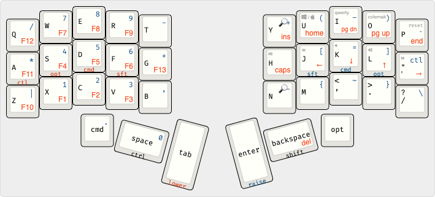

# QMK Keymaps

This is a small repo that contains my custom keymaps and userspace code for QMK.

I got frustrated with keeping my fork of QMK up to date and dealing with merge conflicts. This allows me to keep everything separate.

Bonus - this also keeps VS Code happy by not trying to load the massive C project.

## Layout

### Tap vs Hold

In the diagram above, what's printed on the face of the key is what you get when you tap the key. What's printed on the small front face is what you get when you hold them key. These are modifier keys like `cmd` and `shift`.

For example, the key on your right thumb is `backspace` when pressed, but activates `SHIFT` when held.

There are only 36 keys used by the layout. With so many fewer keys, we rely on layers to fit everything in. It sounds complicated, but you get used to it pretty quickly. 

Everyone already knows about one layer: the `SHIFT` layer.
When you hold `SHIFT`, you get `$` instead of `4` or `D` instead of `d`.

This keyboard layout adds 3 more layers, but you'll mainly use two of them - `RAISE` and `LOWER`. The third is `ADJUST`.

### Raise Layer

Holding down the big thumb key on the right hand actives the `RAISE` layer. The main thing you get here is a number pad on your left hand.  

It also give you modifiers under your right hand on the home row.

Using the `D` as an example:

* On it's own, you get `d`
* Holding down `enter` to activate `RAISE` you get `5`
* Holding down `enter` and holding `J` (for `SHIFT`) you get `%`

The `RAISE` layer keys are shown in blue in the top-right corner of the key in the diagram

### Lower Layer

Similar to `RAISE` holding down the big thumb key on the left hand activates the `LOWER` layer.

The main thing found on this layer is the arrow key and other navigation keys (page up/down, home/end). Arrows are one the home row of the right hand. `J` becomes `left`, `K` becomes `down`, etc.

You have the same home-row modifiers under the left hand that you have on the right with `RAISE`, but the `LOWER` layer also includes the F keys in the same place as the number pad. 

### Adjust Layer

Finally, there are a few other less-frequently used keys on a final layer, `ADJUST`. This is activated by hold both big thumb keys at the same time. Here you have media control on the home row of the right hand, and the top row of the right hand contains some sprecial toggles:

* `U` toggles between Mac and Windows mode. This swaps around the `CTRL` and `CMD`/`WIN` keys.
* `I` sets the input mode to QWERTY
* `O` sets the input mode to [Colemak DH](https://colemakmods.github.io/mod-dh/)
* `P` resets the keyboard and enters flashing mode so you can change the firmware.

The right hand of the `ADJUST` layer controls RGB light effects

* `A` toggles the lights
* `Q` cycles through the lighting effects

## Combos

In addition to all the layers, pressing two (or three) keys at the same time, triggers a different key. For me, these are the most powerful feature of the keyboard.

* `W`+`E` = `Esc`
* `S`+`D` = `Backspace`
* `A`+`S`+`D` = Delete the previous word
* `D`+`F` = `Tab`
* `U`+`I` = `\`
* `J`+`K` = `-`
* `K`+`L` = `:`
* `M`+`,` = `_`
* `,`+`.` = `;`

## Usage

1. Clone the [official QMK repo](https://github.com/qmk/qmk_firmware). No need to fork it unless you are committing changes back upstream.
1. From the local QMK folder run: `bash <path to keymap repo>/add_links.sh`
1. Build and flash as normal (ie. `make crkbd:mforman:avrdude-split-right`)

When finished, discard local changes in the QMK repo so you merge upstream changes with no conflict next time.
